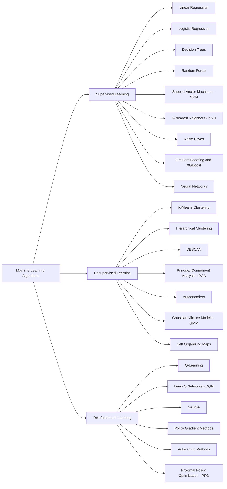
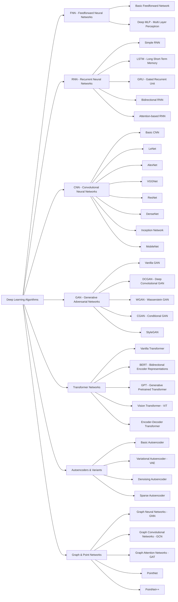

<em>Computer science student at <a href="https://iem.edu.in/">University of Engineering and Management</a> Passionate ML Engineering student <a href="https://medium.com/?tag=deep-learning">ThoughtWorks</a>
  

 

#  Welcome to  My GitHub Account 

Welcome to my repository, where I share website design projects and learning resources for beginners. This collection includes HTML, CSS, JS, and Python-based projects, aiming to provide a comprehensive learning experience for those new to web development. 
##  About the Project 
---------------------------
I'm passionate about exploring the frontiers of artificial intelligence, with a deep focus on machine learning and `Large Language Model (LLM)` development. My work spans designing, training, and deploying `AI agents` capable of tackling complex real-world challenges and enhancing decision-making pipelines. I actively work with advanced `natural language processing`, `predictive modeling`, and neural network architecture design to push the boundaries of what's possible in AI and ML.
I have hands-on experience with `Convolutional Neural Networks (CNNs)`, `PyTorch`, and large multimodal pipelines, particularly in the medical and geospatial domains. My projects include developing cancer image classification systems, satellite image segmentation, and rockfall detection models using OpenPilot and satellite imagery to support safety and monitoring in mining environments.
Currently, I’m expanding my expertise in `Generative Adversarial Networks (GANs)` and `Transformer-based architectures` deepening my understanding of modern LLMs and cutting-edge generative models. I'm continuously exploring innovative techniques to build scalable, robust, and high-impact AI systems.

## Contributing 
----------------------

I welcome contributions from anyone who wants to help improve my repo. Whether you're a seasoned developer or just starting out, your contributions are valued.
**This week I spent my time on** 

### Languages and Tools:

<table>
  <tr>
    <td></td>
    <td></td>
    <td></td>
    <td></td>
    <td></td>
    <td></td>
    <td></td>
    <td></td>
    <td></td>
    <td></td>
    <td></td>
    <td></td>
    <td></td>
  </tr>

  <tr>
    <td></td>
    <td></td>
    <td></td>
    <td></td>
    <td></td>
    <td></td>
    <td></td>
    <td></td>
    <td></td>
    <td></td>
    <td></td>
   <td></td>
    <td></td>
  </tr>
</table>

---

## I'm a Student, ML Enthusiast, Developer, and Self Learner!!

- 🌟 Passionate about combining creativity with tech.
- 🎯 2025 Goals: Build a personal ML project that makes an impact. 
- ✨ Fun fact: Can spend hours debugging code but still feel victorious!
- 💡 Motto: "In programming, it's not about having no bugs, it's about learning how to squash them."
- 🤝 Open to collaborating on Python, ML, and creative tech projects.
- 🌍 Life Mission: To turn ideas into reality with the power of code!

# Machine Learning FLOW CHART 
Here is a clean, readable Mermaid flowchart in Markdown, showing:
Machine Learning Algorithms
Supervised Learning
Unsupervised Learning
Reinforcement Learning
Each category includes the major algorithms under it.

# Deep Learning Flow Charts 
horizontal Mermaid flowchart (LR) for Deep Learning with major categories and variants, similar to your ML chart. I’ll include FNN, RNN, CNN, GAN, Transformers, and other important variants like PointNet, LSTM, GRU, ResNet, Autoencoders etc.

 <em><b>I love connecting with different people</b> so if you want to say <b>hi, I'll be happy to meet you more!</b> :)</em>

---

---

